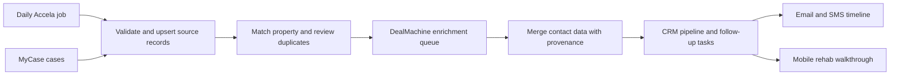

# Mobile rehab calculator and CRM rollout

Reviewed September 29, 2026. This is a proposed implementation plan, not a claim that
CRM features or daily jobs have been deployed.

## Verified starting point

| Component       | What exists                                                                                                     | What still needs connecting                                                                                           |
| --------------- | --------------------------------------------------------------------------------------------------------------- | --------------------------------------------------------------------------------------------------------------------- |
| Rehab estimator | Svelte 5 calculator, 39 categories / 180 items, saved catalog prices, local estimate and photos                 | Multiple properties, cloud sync, offline app launch, CRM association                                                  |
| Email outreach  | Gmail sending, templates, due-contact selection, reply scanning, pixel fetch counts                             | Authenticated CRM, message-level history, durable send queue, accurate contact metrics                                |
| MyCase          | Browserless scraper, pagination and summary extraction, checkpoints, upsert into `indiana_cases` by case number | Review/qualification and matching cases to properties/contacts                                                        |
| Accela          | Indianapolis Enforcement search, CSV export, generated detail links                                             | Unattended worker, explicit date windows, record validation, database ingestion, deduplication, run history, schedule |
| DealMachine     | Existing imported lead/contact data in Supabase                                                                 | Verified account/API access, export/enrichment/import mapping, retry-safe batches                                     |
| Text messaging  | `phones_table` exists                                                                                           | Provider selection, outbound/inbound integration, delivery callbacks, opt-outs, shared conversation timeline          |

Local MyCase and outreach environments target the same Supabase project. Its exposed
schema currently includes `web_leads`, `indiana_cases`, `deal_machine_leads`,
`emails_table`, and `phones_table`. This review inspected schema metadata rather than
exporting contact records. No production schema changes were made.

The Accela checkout matches GitHub HEAD `209f296421a60b0e930329aeea220ea722ab2248`.
MyCase contains ongoing uncommitted changes; those were inspected but not modified.

## One product, optimized for the context

Use one responsive SvelteKit CRM with a phone-first field workflow and a desktop
workspace. The proposed first release is a website; an installable PWA is the next
mobile milestone. A native iOS/Android application is a separate decision.

**Phone:** today's follow-ups, property search, contact timeline, quick notes,
property walkthrough, quantity entry, camera/photos, rehab summary.

**Desktop:** pipeline board/list, import review, duplicates, enrichment batches,
conversation history, campaign controls, automation run history, reporting.

The local calculator now adds a mobile category selector and previous/next controls,
44–48 px touch targets, property-address persistence, a compact total bar with
safe-area spacing, and a modal summary. Desktop category tabs remain available.
It still stores one estimate in this browser. It does not yet synchronize to another
device or guarantee offline launch. LocalStorage photo capacity remains limited.

Before field use across multiple properties, add:

1. Saved estimates per property, with a deliberate new-estimate workflow.
2. IndexedDB for local drafts/photo blobs and cloud object storage for uploaded photos.
3. An explicit saved-locally / syncing / synced state, conflict handling, and retries.
4. A scoped service worker for offline calculator launch after an initial online visit.
   Do not cache OAuth callbacks, outreach APIs, or administrative responses.
5. HTTPS deployment, home-screen installation, and real iPhone/Android checks for
   camera permissions, image sizes, keyboard behavior, interrupted uploads, and offline reload.

PWAs can share a web codebase and support installation/offline behavior, but the
manifest and service-worker work must actually be implemented and tested:
[MDN PWA guidance](https://developer.mozilla.org/en-US/docs/Web/Progressive_web_apps/Guides/Best_practices).

## Data model

Keep source records intact and build CRM entities beside the existing tables. Use
adapters/backfills so the existing scrapers and outreach do not need a simultaneous
rewrite. Add authenticated access and ownership policies before exposing CRM data.

| Proposed entity     | Purpose                                                                              |
| ------------------- | ------------------------------------------------------------------------------------ |
| `properties`        | Canonical address, county/parcel identifier when known, property attributes          |
| `contacts`          | People/businesses; independent of individual properties                              |
| `property_contacts` | Many-to-many relationships: owner, representative, etc.; verification/source         |
| `contact_points`    | Email/phone, source, verification, preferred channel, suppression/opt-out state      |
| `source_records`    | Source + external record ID, source status, first/last seen, raw payload and URL     |
| `source_matches`    | Reviewed links from source records to contacts/properties, confidence and provenance |
| `opportunities`     | Acquisition pipeline stage, assigned person, next action, due date, property         |
| `stage_history`     | Who moved the opportunity, when, from/to stages and reason                           |
| `messages`          | One row per inbound/outbound email or SMS; provider ID, content, channel and status  |
| `message_events`    | Delivery, failure, reply association, image fetch or click events                    |
| `tasks`             | Follow-ups, calls, appointments and manual next actions                              |
| `rehab_projects`    | Property-linked estimate and catalog snapshot, versions, quantities and notes        |
| `photos`            | Storage reference linked to project/category/item                                    |
| `ingestion_runs`    | Source, date window, start/end, new/updated/rejected counts and error state          |
| `enrichment_jobs`   | DealMachine batch IDs, external IDs, requested/completed state, retries and cost     |

Use foreign keys with indexes, unique provider message/event IDs, and unique
`(source, agency, external_record_id)` source keys. Prefer `(county, parcel_id)` for
strong property identity when available. Address normalization produces candidate
matches; ambiguous ownership or unit numbers go to review. Do not deduplicate
contacts by name alone.

MyCase party addresses can be mailing or attorney addresses. A defendant address is
not automatically the subject property. Preserve that distinction during matching.

Keep these statuses separate:

- **Source:** case/violation status, such as pending, open, resolved, dismissed.
- **Processing:** imported → needs review → ready for enrichment → enriching → enriched / no match / failed.
- **Sales pipeline:** new → researching → ready to contact → contacting → responded → appointment → offer → under contract → closed, with nurture / not interested / disqualified outcomes.
- **Contact restrictions:** do-not-contact, invalid address/number, channel opt-out. These are enforced across campaigns, not just one opportunity.

## Communication history and contact counts

Move from the existing email `followup_count` to message-level records. An attempt,
a provider-accepted send, a confirmed delivery, and a reply are different events.
Show sent email count, sent SMS count, failed attempts, last outbound contact,
last inbound reply, and next follow-up separately. Total outbound touches count
unique provider-accepted messages once, not every retry or delivery callback.

Do not manufacture historical per-message records from the existing counter. Retain
it as a legacy aggregate unless actual Gmail history can substantiate a backfill.

Before sending, recheck suppression and inbound replies, acquire a per-contact or
per-campaign send claim, and record the provider result. Reconcile an uncertain
provider timeout before retrying to avoid duplicate messages. All Gmail/SMS
credentials stay server-side. Authenticated users may request a send; anonymous
visitors must not be able to send mail through the existing admin endpoints.

Inbound email/SMS events join the shared timeline, stop or pause applicable
sequences, and create a follow-up task. Filter delivery failures and auto-replies.
Explicit negative/stop responses suppress future outreach as appropriate. Selection
of an SMS provider, sender setup, and messaging-policy requirements are implementation
inputs; no text messages are authorized by this plan alone.

Pixel fetches remain a weak, separately labeled signal. Our live test showed one
fetch on each of two unread messages, including an unopened control, and no new fetch
after a confirmed manual open. Pipeline stages must not advance from pixels alone.

## Daily Accela → DealMachine → CRM flow

The Accela endpoint currently launches a visible Puppeteer browser, subtracts two
days despite a comment saying yesterday, sets only the start date, and returns a CSV.
It has no database connection or scheduling configuration. Its fallback download
logic can select a pre-existing CSV, and computed detail URLs include prefix/sequence
heuristics. Validate links or retain original exported links where available.

Implement the daily worker in this order:

1. Extract the scraper from the HTTP handler into a job with explicit start/end dates,
   Indianapolis timezone, run ID, and a supported unattended browser runtime.
2. Save an immutable raw export per run. Validate actual CSV headers and result
   completeness before accepting it. Handle empty results distinctly from failures.
3. Upsert by agency and record number, preserve source status changes, record
   first/last seen times, and mark a checkpoint only after a complete successful run.
4. Use a small overlapping lookback to catch delayed new filings, plus a separate
   reconciliation pass for older open violations whose status may change.
5. Track counts and errors; prevent overlapping jobs; use bounded retries. A
   challenge or changed website should surface a failed/needs-attention run.
6. Run one supervised sample and a replay of the same window. Prove no duplicate
   leads, preserved updates, cleanup on failure, and usable output before enabling
   the daily schedule.
7. Choose the daily time and hosted scheduler/runtime. A production daily job must
   not depend on a local development server remaining open. Notify on failures and
   meaningful new results, rather than unchanged routine runs.

No daily automation is enabled yet. Scheduling the current CSV endpoint would not
complete database ingestion or enrichment.

Keep enrichment as its own queue. Send only reviewed records that need contact
information, associate a batch/external ID, merge results back into the matched
contact/property, and retain source/date. Repeat runs must not trigger repeat
skip traces unnecessarily or overwrite verified values with missing data.

DealMachine currently documents both a Classic API and a newer property/people API.
Confirm which account/API is available before choosing the connector. The newer API
documents credit usage; set batch and spend limits. A CSV export/import workflow is
a viable first adapter while API access is confirmed.

- [Current DealMachine API](https://api.docs.dealmachine.com/introduction)
- [DealMachine quickstart and credits](https://dealmachine.com/guides/api-quickstart)
- [Classic API reference](https://docs.dealmachine.com/)

## Delivery order and acceptance criteria

1. **Mobile calculator:** touch-friendly walkthrough and desktop parity (local work
   in this pass); follow with multiple estimates, photos, offline launch and device QA.
2. **CRM foundation:** authentication, canonical property/contact records, reviewed
   source linking, pipeline and task list. Same property from two sources appears
   once with both source records attached.
3. **Email timeline:** integrate existing Gmail workflow and legacy counters. Show
   attributable sends/replies; a retry cannot count or send twice.
4. **Daily Accela ingestion:** supervised run, replay/idempotency checks, durable
   storage and run history, then enable the schedule.
5. **DealMachine enrichment:** export/import or verified API adapter; preserve IDs,
   provenance and suppression, with cost limits and retry protection.
6. **SMS:** choose provider, implement sending/inbound/delivery handling and opt-out
   enforcement; test only with designated test numbers before live outreach.

Open decisions: mobile website versus native app, source-case/county filters for
MyCase qualification, daily Accela run time and runtime, DealMachine account/API
version, SMS provider/number, and whether CRM access is single-user or shared.
